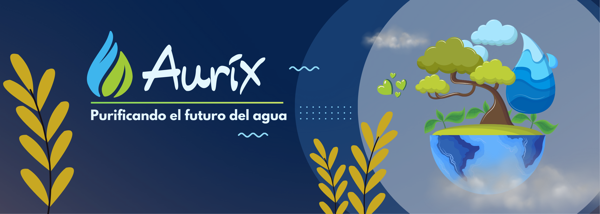
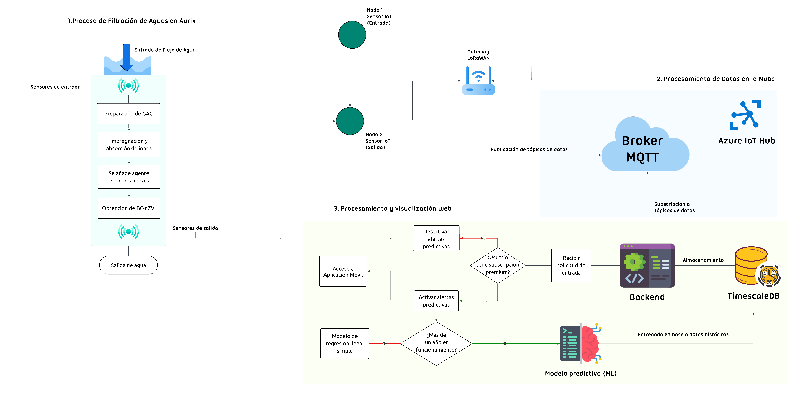
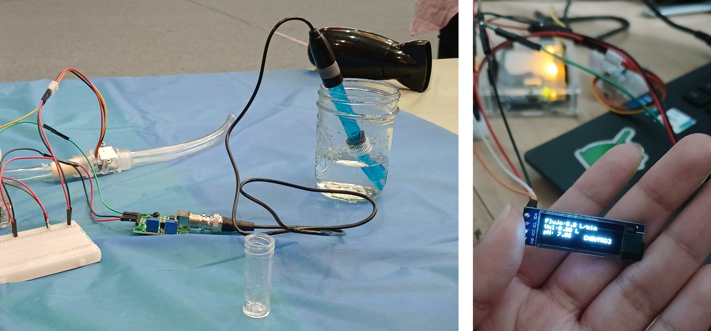
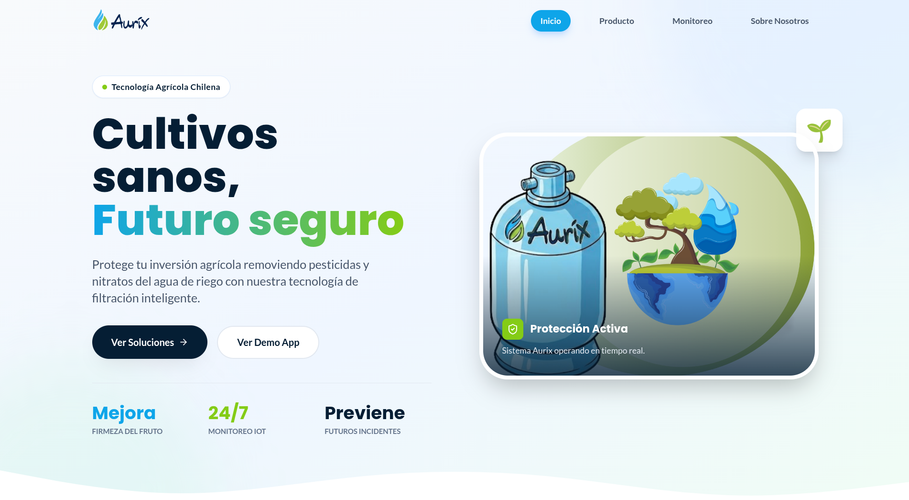

<div align="center">



### Sistema Inteligente de Monitoreo y Filtración de Agua IoT

*Filtro nano-tecnológico con monitoreo en tiempo real*

[](https://flutter.dev)
[](https://mqtt.org)
[](https://www.arduino.cc/)

[Características](#-características-principales) • [Arquitectura](#-arquitectura-del-sistema) • [Instalación](#-instalación) • [Uso](#-uso)

</div>

---

## 🎯 Descripción del Proyecto

**Aurix** es un proyecto académico desarrollado para "Taller de Empresas Tecnológicas" en la Universidad de La Frontera (2025), inspirado en las bases del concurso **Smart Temuco 2025**.

### 💡 Contexto y Alcance

El concepto original propone una solución integral que combina un **filtro físico microestratificado** con un **sistema de monitoreo IoT**. 

**Desarrollo Actual:**
Este repositorio contiene la implementación funcional de la **infraestructura de monitoreo IoT y software**, centrada en:
- **Diseño de Interfaz Móvil**: App en Flutter con visualización avanzada.
- **Integración IoT**: Conexión con sensores mediante Arduino y protocolo MQTT.
- **Simulación en Tiempo Real**: Motor en Python para pruebas de flujo de datos.

### 🔬 Sobre el Filtro (Concepto)

El filtro físico propuesto utiliza capas **micro-estratificadas** que combinan:
- **Biochar modificado** para adsorbción de contaminantes.
- **Nanopartículas de hierro de valencia cero (nZVI)** para remoción de metales pesados.
- **Proceso químico** que fija nZVI sobre biochar de mayor granulometría.

---

## ✨ Características Principales

### 📱 Aplicación Móvil
- 🎛️ **Dashboard en tiempo real** con sistema de semáforo visual (Verde/Amarillo/Rojo).
- � **Gráficos de tendencia temporal** con históricos reales.
- 🔔 **Sistema de alertas** basado en umbrales críticos configurables.
- � **Estadísticas automáticas** (promedio, máximo, mínimo).

### 🌐 Monitoreo IoT & Simulación
- **Sensores**: pH, Turbidez, Conductividad eléctrica y Flujo.
- 📡 Transmisión **MQTT** mediante broker Mosquitto/HiveMQ.
- 🧪 **Simulador IoT**: Script de Python (`iot-simulator`) para generar datos realistas.

### 💻 Presencia Web
- 🚀 **Landing page** deployada en GitHub Pages
- 📱 **Diseño responsivo** mobile-first
- 🎨 **Branding consistente** con la app móvil

---

## 🏗️ Arquitectura del Sistema

<div align="center">

</div>

---

---

## 🚀 Del Prototipo a la Implementación

### Demo Day - Validación de Hardware Real

<div align="center">

</div>

Durante el **Demo Day** de la asignatura se validó la integración física del sistema:
- **Sensor de pH** conectado a Arduino Uno
- **Sensor de flujo** con lectura en tiempo real
- **Display OLED** mostrando métricas en vivo

El sistema demostró comunicación **estable** entre sensores, microcontrolador y broker MQTT público (HiveMQ), validando la arquitectura end-to-end propuesta.

---

### Aplicación Móvil - Interfaz Funcional

<div align="center">

</div>

---

**Estado actual de desarrollo:**

✅ **Implementado:**
- **Hardware IoT**: Sensores físicos + Arduino + MQTT
- **App móvil**: Interfaz completa en Flutter con datos en tiempo real
- **Simulador**: Motor Python para desarrollo sin hardware
- **Arquitectura IoT**: Comunicación end-to-end (sensor → broker → app)

⏳ **Fuera del alcance del prototipo:**

Este prototipo se enfoca en validar la **viabilidad técnica de la arquitectura IoT** y la **experiencia de usuario**. Una implementación completa requeriría:

- **Capa de persistencia**: Base de datos TimescaleDB para series temporales
- **API Backend**: REST/GraphQL para gestión de dispositivos, usuarios e históricos
- **Motor de ML**: Modelo predictivo basado en datos históricos (según arquitectura original)
- **Sistema de notificaciones**: Push notifications con lógica de alertas configurables

> **Nota sobre desarrollo sin hardware:**  
> Para facilitar el desarrollo y pruebas sin acceso físico a sensores, se implementó el módulo `iot-simulator` que genera datos realistas simulando el comportamiento de los sensores reales.

---

### 💻 Landing Page - Presencia Web

<div align="center">

</div>

**🔗 [Ver Demo en Vivo](https://xhandlr.github.io/water-quality-monitoring/)**

Página web desarrollada en **React + Vite + TypeScript** para comunicar la propuesta de valor del sistema. Incluye:

- **Diseño responsivo** con Tailwind CSS
- **Branding cohesivo** con la aplicación móvil
- **Despliegue automatizado** vía GitHub Pages
- **Secciones informativas**: Producto, Monitoreo IoT, Equipo

---

## 🛠️ Stack Tecnológico

### 📱 Frontend (Aplicación Móvil)
| Tecnología | Propósito |
|------------|-----------|
|  | Framework multiplataforma |
|  | Lenguaje de programación |
| `fl_chart` | Visualización de gráficos |

### ⚙️ IoT & Simulación
| Tecnología | Propósito |
|------------|-----------|
|  | Protocolo de comunicación IoT |
|  | Simulador de datos y Gateway Serial |
|  | Firmware de sensores |

### 💻 Frontend Web
| Tecnología | Propósito |
|------------|-----------|
|  | Framework UI |
|  | Lenguaje tipado |
|  | Build tool |
|  | Framework CSS |

---

## 📂 Estructura del Proyecto

```
app-mobile/       # Aplicación móvil en Flutter
firmware/         # Código Arduino y Gateway Serial-MQTT
iot-simulator/    # Simulador de datos en Python (antes ml-engine)
frontend/         # Landing page (React + Vite)
```

---

## 📦 Instalación

### 1. Aplicación Móvil
```bash
cd app-mobile
flutter pub get
flutter run
```

### 2. Simulador de Datos
```bash
cd iot-simulator
pip install -r requirements.txt
python models/mqtt_simulator.py
```

---

## 🎨 Diseño y Paleta de Colores

```dart
// Colores principales
Primary:    #1E88E5  // Azul principal
Background: #000E22  // Azul oscuro profundo
Success:    #4CAF50  // Verde (valores normales)
Warning:    #FF9800  // Naranja (precaución)
Critical:   #F44336  // Rojo (alerta crítica)
```

---

## 📝 Licencia e Integridad Académica

⚠️ **AVISO DE INTEGRIDAD ACADÉMICA**

Este proyecto fue desarrollado para "Taller de Empresas Tecnológicas" en la Universidad de La Frontera (2025). Utiliza una **licencia personalizada** que permite uso comercial pero prohíbe específicamente participación en competiciones. 

Ver el archivo [LICENSE](LICENSE) para más detalles.

[](LICENSE)


---

## 👥 Autor

Desarrollado con 💙 por [xhandlr](https://github.com/xhandlr)

---

<div align="center">

**Aurix** - Agua limpia, datos claros, futuro sostenible 💧

</div>

